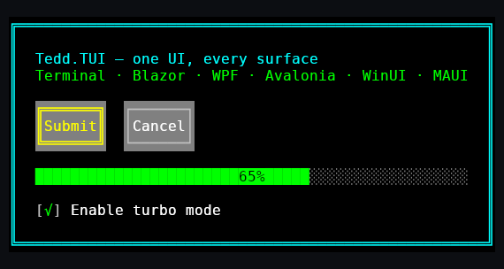

# Tedd.TUI

[](https://github.com/tedd/Tedd.TUI/actions/workflows/build.yml)
[](https://www.nuget.org/packages/Tedd.TUI)
[](LICENSE)

**Tedd.TUI** is a high-performance, Cross-Platform Text User Interface (TUI) Framework for .NET 10, architected with WPF-inspired design patterns. It features a robust visual tree, hierarchical data binding, a recursive layout engine, and an event system, all optimized for zero-allocation rendering.

Define the UI once — in XAML or in code — and host it anywhere: **terminal, Blazor, WPF, Avalonia, WinUI 3, .NET MAUI, native SDL2 windows and any bare SkiaSharp canvas** (headless PNG rendering included). Every host renders the identical character-cell grid.



📖 **[Documentation](docs/README.md)** · **[Getting started](docs/getting-started.md)** · **[XAML guide](docs/xaml.md)** · **[Website](https://tedd.github.io/Tedd.TUI/)**

## Packages

| Package | NuGet | Purpose |
|---|---|---|
| `Tedd.TUI` | [](https://www.nuget.org/packages/Tedd.TUI) | Core: controls, layout, binding, XAML loader |
| `Tedd.TUI.Platform.Console` | [](https://www.nuget.org/packages/Tedd.TUI.Platform.Console) | Terminal host (`TuiApp`), backend auto-detection |
| `Tedd.TUI.Platform.WindowsTerminal` | [](https://www.nuget.org/packages/Tedd.TUI.Platform.WindowsTerminal) | Windows terminal backend (truecolor, mouse) |
| `Tedd.TUI.Platform.LinuxTerminal` | [](https://www.nuget.org/packages/Tedd.TUI.Platform.LinuxTerminal) | Linux/macOS terminal backend (truecolor, mouse, inline images) |
| `Tedd.TUI.Platform.Blazor` | [](https://www.nuget.org/packages/Tedd.TUI.Platform.Blazor) | Browser host: Canvas/DOM surfaces, Razor components, `TuiXamlView` |
| `Tedd.TUI.Platform.Wpf` | [](https://www.nuget.org/packages/Tedd.TUI.Platform.Wpf) | WPF host (`TuiHostElement`) with XAML-designer live preview |
| `Tedd.TUI.Platform.Avalonia` | [](https://www.nuget.org/packages/Tedd.TUI.Platform.Avalonia) | Avalonia host (`TuiHostControl`) for Windows/macOS/Linux |
| `Tedd.TUI.Platform.WinUI` | [](https://www.nuget.org/packages/Tedd.TUI.Platform.WinUI) | WinUI 3 host (`TuiHostControl`) |
| `Tedd.TUI.Platform.Maui` | [](https://www.nuget.org/packages/Tedd.TUI.Platform.Maui) | .NET MAUI host (`TuiHostView`) for Android/iOS/macOS/Windows |
| `Tedd.TUI.Platform.Skia` | [](https://www.nuget.org/packages/Tedd.TUI.Platform.Skia) | Standalone Skia host (`TuiSkiaHost`): any `SKCanvas`, headless PNG screenshots |
| `Tedd.TUI.Platform.Sdl2` | [](https://www.nuget.org/packages/Tedd.TUI.Platform.Sdl2) | SDL2 host (`TuiSdl2Host`): native SDL2 window or attach to your SDL render loop |
| `Tedd.TUI.Surface.Skia` | [](https://www.nuget.org/packages/Tedd.TUI.Surface.Skia) | Shared SkiaSharp cell painter used by the Skia/Avalonia/WinUI/MAUI hosts |
| `Tedd.TUI.Imaging` | [](https://www.nuget.org/packages/Tedd.TUI.Imaging) | Bitmap decoding for image-aware controls (Magick.NET) |

## Features

- **WPF-Inspired Core:** Built on a `UIElement` base with a lightweight `DependencyProperty` system and hierarchical Visual Tree.
- **Advanced Layout Engine:** Implements a comprehensive two-pass `Measure` and `Arrange` protocol.
  - **Grid:** Supports `RowDefinition`, `ColumnDefinition`, `Star` (*) sizing, and `Auto` sizing. The `Grid` component layout performance is optimized by caching attached properties (`Row`, `Column`, `RowSpan`, `ColumnSpan`) into a `GridChildInfo` struct and `Span<T>` during `MeasureOverride` and `ArrangeOverride` to minimize `DependencyObject.GetValue` dictionary lookup overhead.
  - **UniformGrid:** Symmetrical grid layouts via `Rows` and `Columns` dependency properties.
  - **StackPanel:** Vertical and horizontal stacking.
  - **WrapPanel:** Sequential layout with line/column wrapping.
  - **DockPanel:** Edge-docking arrangements using the `Dock` attached property.
  - **Canvas:** Absolute positioning via `Canvas.Left` and `Canvas.Top` attached properties.
  - **ScrollViewer:** Unbounded layout constraints allowing `Panel` contents to evaluate bounds up to `int.MaxValue`, coupled with `ScrollBar` for navigation. Scrollbar visibility is configured through the `ScrollBarVisibility` enum (`Disabled`, `Auto`, `Visible`) on both `HorizontalScrollBarVisibility` and `VerticalScrollBarVisibility`. `Disabled` clamps the content to the viewport in that axis (so wrappable children re-flow to fit on resize); `Auto` resolves visibility per-frame from the measured content extent and reserves a row/column only when the bar is actually shown; `Visible` always shows the bar and reserves space.
  - **Border:** Decorative borders with box-drawing characters.
- **Rich Control Suite:**
  - **DataGrid:** Supports `ItemsSource` binding, `AutoGenerateColumns`, selection, and pagination.
  - **Table:** Manual row management with sorting, pagination, and header customization. In `Table`, performance is optimized by caching the `TotalWidth` in the Table and a per-column `Offset` in `TableColumn` during `MeasureOverride`, reducing layout and rendering complexity from O(Rows * Columns) to O(Rows + Columns). Supports structural customization via properties such as `ShowBorder`, `ShowHeader`, `ShowVerticalLines`, `ShowHorizontalLines`, and `BorderStyle` (e.g., `BoxStyle.Heavy`, which requires exact Unicode matching for borders like `\u2533` TDown and `\u253B` TUp), while its columns are defined via `TableColumn` utilizing `GridLength` for widths.
  - **MarkdownView:** Renders Markdown content with theming support.
  - **CodeDocument:** Renders syntax-highlighted source code utilizing the internal CodeColoring engine and customizable themes.
  - **Standard Controls:** `Button`, `RepeatButton`, `TextBox`, `PasswordBox`, `TextEditor`, `CheckBox`, `RadioButton`, `ToggleSwitch`, `ProgressBar`, `TabControl`, `ListBox`, `ComboBox`, `GroupBox`, `TreeView`, `TreeViewItem`, `HeaderedItemsControl`, `Expander`, `DialogBox`, `UniformGrid`, `ScrollViewer`, `ScrollBar`, `Thumb`, `Slider`, `NumericUpDown`, `Calendar`, `DatePicker`, `TimePicker`, `GridSplitter`, `MenuBar`, `Separator`.
  - **Button:** Supports retro-computing DOS-era control aesthetics via the `ShadowStyle` dependency property (utilizing the `ButtonShadowStyle` enumeration), alongside complimentary properties (`ShadowForeground`, `ShadowBackground`, `ShadowOffsetX`, `ShadowOffsetY`) that facilitate vintage visual depth while operating seamlessly within modern hierarchical binding contexts.
  - **ListBox:** Achieves WPF architectural isomorphism by utilizing a `ControlTemplate` wrapping an `ItemsPresenter` within a `ScrollViewer`, removing custom `MeasureOverride` and `Render` logic and deferring layout to standard XAML paradigms. The generated container, `ListBoxItem`, inherits from `ContentControl` and manages its visual state via the `IsSelected` dependency property and `Selected`/`Unselected` bubbling routed events.
  - **Slider:** Inherits from `UIElement` and exposes a bubbling `ValueChanged` routed event (`ValueChangedEvent`) that is raised from `OnPropertyChanged` when `ValueProperty` changes; the `Value` property setter performs clamping and change guarding without directly invoking the event, preserving WPF-style routed event semantics.
  - **Thumb:** Inherits from `Control` and acts as a primitive drag control. It provides standard WPF-equivalent bubbling routed events for drag lifecycles (`DragStarted`, `DragDelta`, and `DragCompleted`). The coordinate properties in specialized event arguments like `DragDeltaEventArgs.HorizontalChange` use `double` to maintain API parity with WPF, despite underlying integer mouse coordinates.
  - **GridSplitter:** Inherits from `Thumb` and dynamically adjusts the `GridLength` of adjacent `RowDefinition` and `ColumnDefinition` elements via the `DragDelta` routed event, implicitly modifying adjacent definitions (e.g., `c - 1` and `c + 1`) when occupying its own dedicated cell index.
  - **MenuBar:** Inherits from `StackPanel` to provide a horizontal menu strip (typically aligned at the top) for `MenuItem` elements, establishing layout and visual defaults (orientation, background, alignment) and rendering the background; submenu and open/close behavior is implemented by `MenuItem`. `MenuItem.OpenSubMenu` automatically triggers a layout pass (`Measure` and `Arrange`) on the root `TuiWindow` if the window has a valid size (using `RenderSize` or `Width`/`Height` properties), ensuring correct popup positioning without manual intervention.
  - **Separator:** Inherits from `Control`, explicitly setting `Focusable = false`, and rendering a horizontal line using the `\u2500` character to match the DOS-era styling, implementing standard XAML parity for menus and layouts.
  - **ItemsControl:** Inherits from `Control` and utilizes an `ItemsPanel` property (`ItemsPanelTemplate`) alongside an `ItemsPresenter` to generate and populate its visual layout panel, aligning with WPF logical separation. It supports dynamic data mapping via `ItemTemplate` (`DataTemplate`), automatically propagating the ambient data object to a generated `ContentPresenter` during `PrepareContainerForItemOverride`.
  - **Expander:** Inherits from `HeaderedContentControl`, utilizing the `IsExpanded` dependency property and `Expanded`/`Collapsed` bubbling routed events to toggle `ContentPresenter.Visibility` for progressive disclosure.
  - **GroupBox:** Subclasses `HeaderedContentControl` and leverages the `ControlTemplate` engine to map its `Header` and `Content` into a visual `Border`, establishing structural parity with standard WPF grouping conventions.
  - **PasswordBox:** Inherits from `Control` and employs a `ControlTemplate` housing a `TextBox` with `IsPassword = true`, bridging a crucial parity gap for secure input masking by intercepting `OnKeyDown` events to synchronize an exposed `Password` property.
- **Data Binding:** Hierarchical `DataContext` inheritance with `INotifyPropertyChanged` support.
- **High Performance:** Designed with a "Zero-Allocation" rendering philosophy, utilizing `Span<char>`, `stackalloc`, and double-buffered `VirtualBuffer` diffing to minimize I/O and GC pressure.
- **Cross-Platform:** Decoupled rendering pipeline with hosts for the terminal (Windows/Linux/macOS), Blazor (Canvas or DOM), WPF (with XAML-designer live preview), Avalonia, WinUI 3, .NET MAUI, SDL2 (native window or your own render loop) and standalone Skia (any `SKCanvas`, headless PNG) — all painting the same `VirtualBuffer` cell grid.

## Getting Started

### Prerequisites

- .NET 10.0 SDK

### Building

```bash
cd src
dotnet build
```

### Running Tests

```bash
cd src
dotnet test
```

### Usage Example

The following example demonstrates how to create a simple MVVM-style application using `TuiApp` and Data Binding.

```csharp
using System;
using System.ComponentModel;
using System.Runtime.CompilerServices;
using Tedd.TUI;
using Tedd.TUI.Controls;
using Tedd.TUI.Data;
using Tedd.TUI.Platform.Console;

namespace MyTuiApp;

// 1. Define a ViewModel implementing INotifyPropertyChanged
public class MainViewModel : INotifyPropertyChanged
{
    private int _clickCount = 0;

    public string Status
    {
        get => field;
        set
        {
            if (field != value)
            {
                field = value;
                OnPropertyChanged();
            }
        }
    } = "Ready";

    public void OnButtonClick()
    {
        _clickCount++;
        Status = $"Button Clicked {_clickCount} times!";
    }

    public event PropertyChangedEventHandler? PropertyChanged;
    protected void OnPropertyChanged([CallerMemberName] string? propertyName = null)
    {
        PropertyChanged?.Invoke(this, new PropertyChangedEventArgs(propertyName));
    }
}

class Program
{
    static void Main(string[] args)
    {
        // 2. Create the main window
        var window = new TuiWindow();

        // 3. Set the DataContext for binding
        var viewModel = new MainViewModel();
        window.DataContext = viewModel;

        // 4. Initialize the application with the Console platform
        var app = new TuiApp(window);

        // 5. Define the UI layout
        var stack = new StackPanel
        {
            Orientation = Orientation.Vertical,
            HorizontalAlignment = HorizontalAlignment.Center,
            VerticalAlignment = VerticalAlignment.Center
        };

        // Title TextBlock
        var titleBlock = new TextBlock
        {
            Text = "Hello Tedd.TUI!",
            Foreground = TuiColor.Cyan,
            HorizontalAlignment = HorizontalAlignment.Center
        };
        stack.Children.Add(titleBlock); // UIElementCollection sets Parent automatically

        // Status TextBlock with Data Binding
        var statusBlock = new TextBlock
        {
            Foreground = TuiColor.Green,
            HorizontalAlignment = HorizontalAlignment.Center
        };
        // Bind Text property to ViewModel.Status
        statusBlock.SetBinding(TextBlock.TextProperty, new Binding("Status"));
        stack.Children.Add(statusBlock);

        // Button with Click Handler and DOS-era aesthetics
        var button = new Button
        {
            Content = "Click Me",
            ShadowStyle = ButtonShadowStyle.Solid,
            ShadowBackground = TuiColor.Black
        };

        // Subscribe to the Click event (Routed Event)
        button.Click += (s, e) =>
        {
            viewModel.OnButtonClick();
        };
        stack.Children.Add(button);

        // 6. Set the window content
        window.Content = stack;

        // 7. Run the application loop
        app.Run();
    }
}
```

## Architecture

### Namespace Organization

Tedd.TUI organizes types into WPF-inspired namespaces for clarity and discoverability:

- **`Tedd.TUI`** — Core framework: `UIElement`, `DependencyProperty`, `DependencyObject`, `Style`, `Trigger`, `RoutedEvent`, `Binding`, `DataTemplate`, `XamlLoader`, `ThemeManager`, `TuiTheme`, `TuiWindow`, `Window` (floating overlay), `Dialog` family, `Geometry` types, color and enum types.
- **`Tedd.TUI.Controls`** — Interactive controls: `Border`, `Button`, `Calendar`, `Canvas`, `CheckBox`, `ComboBox`, `ContentControl`, `DataGrid`, `DatePicker`, `DockPanel`, `Expander`, `Grid`, `GridSplitter`, `GroupBox`, `ItemsControl`, `ListBox`, `MenuBar`, `MenuItem`, `NumericUpDown`, `PasswordBox`, `ProgressBar`, `RadioButton`, `ScrollBar`, `ScrollViewer`, `Separator`, `Slider`, `StackPanel`, `TabControl`, `TabItem`, `Table`, `TextBlock`, `TextBox`, `TextEditor`, `TimePicker`, `ToggleSwitch`, `TreeView`, `TreeViewItem`, `UniformGrid`, `WrapPanel`.
- **`Tedd.TUI.Controls.Primitives`** — Base classes for interactive controls: `ButtonBase`, `RepeatButton`, `Thumb`, `Selector`, `ToggleButton`.
- **`Tedd.TUI.Data`** — Data binding: `Binding` (resolves to `Tedd.TUI.Binding` via `global using`).
- **`Tedd.TUI.Markup`** — XAML processing: `XamlLoader`, `MarkupExtensionParser`.
- **`Tedd.TUI.Media`** — Rendering primitives: `VirtualBuffer`, `IRenderer`, `GraphicPlacement`, `RenderLayer`, `LayerCompositor`, `AnsiTrueColorRenderer`, `BoxDrawing`, `SixelEncoderCore`.
- **`Tedd.TUI.Markdown`** — Rich text: `MarkdownView`, `FlowDocument`, `Paragraph`, `Hyperlink`, `Image`, `MarkdownTheme`, `RgbColorPalette`, renderers for images.
- **`Tedd.TUI.CodeColoring`** — Syntax highlighting: `Grammar`, `Theme`, `Token`, `LanguageRegistry`, `PrismTokenizer`, regex utilities, and 76 bundled languages.

Consumer projects must explicitly import required namespaces via per-file `using` directives (e.g., `using Tedd.TUI.Controls;`) or project-level global usings, as the internal `GlobalUsings.cs` file is scoped exclusively to the compilation of the `Tedd.TUI` core library itself.

### Core System
At the heart of Tedd.TUI is the `UIElement` class, which provides the foundation for:
- **Visual Tree:** A hierarchical structure of elements allowing for complex composition. Any `UIElement` can dynamically ascend the visual tree to resolve its root host via the `GetRoot()` API, enabling recursive topological queries.
- **Dependency Properties:** A property system that supports value inheritance, change notification, and memory conservation. `DependencyObject` implements `ClearValue` to deterministically remove local property overrides (allowing fallback to default or inherited values), while `SetValue(null)` explicitly stores a null value rather than deleting the entry, maintaining strict WPF isomorphism. Dependency Property value precedence within `DependencyObject.GetValue()` is resolved using discrete `_localValues` and `_triggerValues` dictionaries rather than a monolithic store: a local value assigned after a trigger becomes active overrides that trigger, otherwise an active trigger value overrides any pre-existing local value, followed by ordinary local values, inherited values, and finally default metadata. In other words, the effective order is post-trigger local override > trigger > local > inherited > default. Dependency Property accessors utilize C# expression-bodied members (`get => ...; set => ...;`) to minimize lexical boilerplate. Furthermore, API signatures deviate slightly from standard WPF: `DependencyProperty.Register` accepts default values directly rather than wrapped in a `PropertyMetadata` object.

### Data Binding
Tedd.TUI implements a hierarchical data binding infrastructure analogous to WPF, systematically driven by the `DataContext` inherited dependency property. This established framework capability mitigates the need for speculative manual state synchronization.
- **DataContext Inheritance:** The `DataContext` property is an explicitly defined inherited dependency property. The `DependencyObject` base architecture resolves inherited values by recursively querying `InheritanceParent` (which maps to `Parent` in `UIElement`). Assigning a `DataContext` at the visual root (e.g., `TuiWindow`) makes the data model available to descendant elements that have not set a local `DataContext`. Propagation is implemented in `UIElement.OnPropertyChanged` for inherited dependency properties by enumerating `GetVisualChild` and calling `OnPropertyChanged(dp)` on children that do not have a local value, which in turn updates bindings.
- **INotifyPropertyChanged:** Models must implement `System.ComponentModel.INotifyPropertyChanged`. The internal `BindingExpression` autonomously hooks and unhooks to `PropertyChanged` events upon `DataContext` mutations, re-evaluating reflection paths when property names match or signify wholesale updates.
- **Binding Resolutions:** The `SetBinding` method establishes a dynamic link between a target dependency property and a source property. While bindings default to resolving against the ambient `DataContext`, the framework exposes robust `RelativeSource` topologies:
  - `Self`: Targets the `UIElement` itself.
  - `TemplatedParent`: Essential for `ControlTemplate` implementations, targets the origin control instantiating the template visual tree.
  - `FindAncestor`: Ascends the visual tree utilizing `AncestorType` and `AncestorLevel` reflection checks, useful in recursive layout bindings.
- **Collections:** Utilizing `DataGrid` or derivatives of the `Selector` class (`ListBox`, `ComboBox`, `TabControl`) enables binding directly to collections via the `ItemsSource` property. The framework resolves reflection text paths (via `DisplayMemberPath`) utilizing internal string cache pools synchronized securely with C# 13's `System.Threading.Lock`. To circumvent reflection bottlenecks during large dataset rendering, `DataGrid` optimizes bound property access performance by utilizing `System.Linq.Expressions` to compile getter delegates (`Func<object, object>`), which are globally cached in a static dictionary protected by a discrete C# 13 `System.Threading.Lock` for reuse across grid instances.

### Layout Engine
The framework employs a robust, recursive two-pass layout system orchestrated by the abstract `Panel` class:
1.  **Measure Pass:** Container elements recursively query their children, invoking `Measure(Size availableSize)` to compute their `DesiredSize` based on layout constraints. The `UIElement` explicitly calculates requested bounds factoring in the `Margin` dependency property (`Thickness`), effectively reducing the available size passed down. Note that standard WPF layout invalidation (`InvalidateMeasure()`) is absent; topological re-evaluation is universally triggered via `Invalidate()`.
2.  **Arrange Pass:** Parents position and size their children within the computed physical bounds by invoking `Arrange(Rect finalRect)`, which applies structural offsets for `Margin`. Container controls inheriting from `Control` further apply `Padding` (`Thickness`) during their `MeasureOverride` and `ArrangeOverride` operations to reduce inner available space for their embedded `TemplateRoot`. Within layout calculations, exact element dimensions must be accessed via `RenderSize.Width` and `RenderSize.Height` instead of the traditional `ActualWidth` and `ActualHeight` properties.
3.  **Render Pass:** The actual rendering to the `VirtualBuffer` is heavily optimized. Containers executing the `Render` method utilize clipping rects to skip elements that are fully clipped or lie completely outside the current clip rectangle, drastically reducing CPU cycles in complex visual trees.

**Hierarchical Composition:** The abstract `Panel` base class manages composition via its `Children` property (a `UIElementCollection`). For concrete descendants (`StackPanel`, `Grid`, `DockPanel`, `WrapPanel`, `Canvas`, and `UniformGrid`), this collection systematically intercepts modifications. Executing `Panel.Children.Add(child)` strictly enforces visual tree integrity by automatically assigning the parent node, which inherently triggers `DataContext` propagation and establishes the routing infrastructure for input events. To ensure rendering fidelity while minimizing GC pressure, `Panel` maintains a cached `_zSortedChildren` array that is rebuilt when Z-order is invalidated and performs stable Z-Index sorting via a custom $O(N \log N)$ iterative merge sort using temporary buffers rented from `ArrayPool<T>`, rather than relying on ad-hoc in-place permutations.

### Overlay System
Tedd.TUI implements a robust stacking overlay system orchestrated by `TuiWindow`. This architecture is designed to bypass standard document-flow layout passes for modal or transient visual elements (such as `DialogBox` and context menus).
- **Stacking Mechanics:** Overlays are managed chronologically via `PushOverlay` and `RemoveOverlay` (superseding the obsolete `SetOverlay` method). Overlays are structurally appended as integral components of the `TuiWindow` Visual Tree (resolvable via `GetVisualChild`) and receive the ambient `DataContext` as a one-time assignment when inserted. Because this establishes a local `DataContext` value on the overlay, subsequent `TuiWindow.DataContext` changes do not automatically propagate to existing overlays through inherited dependency-property semantics unless that local value is cleared. However, they explicitly bypass the standard recursive `Measure` and `Arrange` passes of `TuiWindow`, requiring their layout to be managed independently by the element (e.g., deterministic sizing inside `DialogBox`). Internally, the stacking system optimizes topological checks utilizing a `List<UIElement>` to provide $O(N)$ presence verification while preventing redundant stack allocations.
- **Rendering & Hit-Testing Priority:** To achieve absolute visual supremacy, the `Render` pipeline processes the overlay collection iteratively *after* the primary `Content`. Conversely, the deterministic input routing system evaluates the overlay stack in reverse topological order (top-to-bottom) during `InputHitTestRecursive`, ensuring the active overlay intercepts global input coordinates before underlying standard components.

### Input & Interaction
Input handling is orchestrated by a deterministic Routed Event architecture managed within `UIElement`:
- **Overlay Management:** `TuiWindow` provides a stacking overlay system via `PushOverlay` and `RemoveOverlay` methods (the legacy `SetOverlay` is obsolete). Overlays are managed chronologically, rendered sequentially (Z-index parity on top of the visual tree), and are evaluated via reverse-topological hit-testing first, providing a robust architecture for modal dialogs and transient components.
- **Mouse Capture:** Global mouse capture for component drag interactions (such as with the `Thumb` control) is managed via `TuiWindow.CaptureMouse(UIElement)` and `TuiWindow.ReleaseMouseCapture()`. This ensures deterministic routing of all subsequent mouse events to the capturing element regardless of cursor bounds.
- **Custom Event Routing:** Custom routed event arguments (such as `DragEventArgs`) can expose strongly typed delegate aliases (e.g., `DragStartedEventHandler`) for consumer ergonomics, but the runtime dispatch path on `UIElement` invokes handlers by casting to `RoutedEventHandler` when possible and otherwise falling back to `Delegate.DynamicInvoke`. There is no requirement for custom `RoutedEventArgs` types to override `InvokeEventHandler`; the framework does not depend on that virtual for handler invocation.
- **Standard Input Events:** Primitive interactions (`KeyDown`, `KeyUp`, `MouseDown`, `MouseUp`, `GotFocus`, `LostFocus`) are registered via `RoutedEvent.Register`. The core supports comprehensive `RoutingStrategy` execution topologies: `Tunnel` (down from root to leaf), `Bubble` (up from leaf to root), and `Direct` (local invocation isolated to the source).
- **Control State Events:** Interactive toggle controls (`CheckBox`, `RadioButton`) implement `Checked` and `Unchecked` bubbling routed events, dispatching dynamically from their `OnPropertyChanged` overrides when `IsCheckedProperty` mutates, guaranteeing robust parent container interception. `RadioButton` explicitly performs global synchronous group updates prior to dispatching `Checked` to enforce uniform topological flow.
- **Execution Phases:** WPF-style two-phase input dispatch (tunneling `Preview*` followed by the paired bubbling event) is implemented by input dispatchers such as `TuiWindow.ProcessKey` (and the console mouse input manager): they raise the corresponding `Preview*` tunneled routed event first and, if it is not handled, then raise the paired bubbling event. Each individual routed event is delivered via `UIElement.RaiseEvent`, which builds the route by walking `Parent` references into an `ArrayPool<UIElement>` buffer (O(h) space where h is tree depth, typically avoiding per-call GC allocations after pool warm-up) and then invokes handlers according to the event’s `RoutingStrategy` (Tunnel: root → source, Bubble: source → root, Direct: source only). When `Handled` is true, traversal continues but instance handlers are skipped unless registered with `handledEventsToo = true`.
- **Coordinate Resolution:** During mouse event dispatch, `UIElement.InvokeHandler` intercepts the `RoutedEventArgs` payload. It dynamically translates absolute global screen coordinates (`GlobalX`, `GlobalY`) into the local `RenderSize` space of the invoking element (updating the `X` and `Y` properties) utilizing `PointFromScreen` prior to emitting the class handler invocation.
- **Class vs. Instance Handlers:** The `InvokeHandler` routine systematically prioritizes overridden virtual methods (e.g., `OnKeyDown`, `OnMouseDown`), which act as implicit class handlers. Subsequentially, it dynamically invokes explicitly bound delegates from the `_eventHandlers` dictionary, effectively decoupling core layout response logic from external subscriber callbacks.
- **High-Level Abstractions:** Semantic control events (e.g., `Button.ClickEvent`) seamlessly integrate into the identical bubbling routing topology, ensuring uniform event interception and traversal behavior across component boundaries.

### Rendering Pipeline
Rendering is decoupled from the platform implementation.
- **VirtualBuffer:** The UI renders to an abstract double-buffered grid (`VirtualBuffer`).
- **Diffing Algorithm:** The renderer compares the current frame with the previous one, emitting only the changed characters and color codes to the console. This minimizes I/O operations, which are the primary bottleneck in console applications.
- **Zero-Allocation:** Heavy use of `Span<char>` and `stackalloc` ensures that the rendering loop generates minimal garbage, maintaining high throughput and low latency.
- **Event-Driven Loop:** The `TuiApp` loop uses OS primitives (`WaitForMultipleObjects` on Windows, `WaitHandle.WaitAny` on *nix) to sleep efficiently until input is received or a visual update is requested, ensuring near-zero CPU usage when idle.


### Blazor Integration
The `Tedd.TUI.Platform.Blazor` library provides wrappers for integrating TUI components into Blazor applications.
- **Two-way Binding:** Implementing two-way binding for wrapper components (like `TuiSlider` or `TuiPasswordBox`) requires creating an internal nested subclass of the target control (e.g., `ListeningSlider : Slider`) that overrides `OnPropertyChanged` to detect `DependencyProperty` changes and invoke the parent component's `EventCallback`.
- **Raw UIElement Integration:** Raw `UIElement` components that lack dedicated Blazor wrappers (like `CodeDocument` or `DataGrid`) can be integrated into `.razor` files by wrapping them with the generic `<TuiHost Component="@element" />` component.

### Platform Abstraction
- **Tedd.TUI (Core):** Contains the framework logic (`UIElement`, `Grid`, `Table`, etc.) and is platform-agnostic.
- **Tedd.TUI.Platform.Console:** Provides the concrete implementation of `IConsole`, the input manager, and the `TuiApp` host for terminal environments.
- **GUI hosts:** `Tedd.TUI.Platform.Wpf` (`TuiHostElement`, renders via `DrawingContext` and previews live in the Visual Studio XAML designer), `Tedd.TUI.Platform.Avalonia`, `Tedd.TUI.Platform.WinUI` and `Tedd.TUI.Platform.Maui` (all painting through the shared `Tedd.TUI.Surface.Skia` cell painter). `Tedd.TUI.Platform.Skia` (`TuiSkiaHost`) drops the GUI framework entirely and renders onto any bare `SKCanvas` — or headless to `SKImage`/PNG — for game engines, custom windowing and CI screenshots. `Tedd.TUI.Platform.Sdl2` (`TuiSdl2Host`) builds on it to open a native SDL2 window in one call, or attaches to the SDL2 window/renderer a game or emulator already owns. Each host is a thin display driver: it paints the flattened `VirtualBuffer` and feeds keyboard/mouse input back in cell coordinates, so behavior and looks are identical across surfaces. See the [per-platform guides](docs/README.md#platform-hosts).


### Planned Future Enhancements (Hypotheses)
The framework's current iteration achieves robust WPF structural parity. However, the following concepts remain hypotheses under investigation and are not yet functionally implemented:
- **C# 14 `allows ref struct`:** Upgrading generic constraints to support `ref struct` types in fundamental inheritance hierarchies.
- **Speculative Performance Refactoring:** Additional elimination of `AsSpan()` allocations beyond the verified string search method upgrades.

## XAML Support

Tedd.TUI supports defining UI in XAML. You can load XAML at runtime using `XamlLoader`.
The loader tolerates XML namespaces, `x:Name` and designer attributes (`mc:Ignorable`,
`d:DesignWidth`, …), so the same file can be edited in a XAML editor — with live preview
via the WPF host's `TuiHostElement` — and shipped unchanged to the terminal, Blazor
(`TuiXamlView`), Avalonia, WinUI and MAUI hosts. See the [XAML guide](docs/xaml.md).

**Example XAML (`demo.xaml`):**
```xml
<TuiWindow>
  <StackPanel Orientation="Vertical">
    <TextBlock Text="Hello from XAML!" Foreground="Cyan"/>
    <Button Name="SubmitButton" Content="Click Me" Click="OnSubmit"/>
  </StackPanel>
</TuiWindow>
```

**Loading XAML:**
```csharp
using System.IO;
using Tedd.TUI;
using Tedd.TUI.Markup;
using Tedd.TUI.Platform.Console;

var controller = new MyController(); // Contains OnSubmit method
var window = (TuiWindow)XamlLoader.Load(File.ReadAllText("demo.xaml"), controller);
var app = new TuiApp(window);
app.Run();
```

**Controller:**
```csharp
using Tedd.TUI;
using Tedd.TUI.Controls;

class MyController
{
    // Field name matches x:Name in XAML for injection
    public Button SubmitButton = null!;

    // Method name matches Click handler in XAML
    public void OnSubmit(object sender, RoutedEventArgs e)
    {
        // Handle click
    }
}
```

## License

This project is licensed under the MIT License - see the LICENSE file for details.

The syntax highlighting grammars in `Tedd.TUI.CodeColoring` are derived from [Prism.js](https://github.com/PrismJS/prism) (MIT) - see [THIRD-PARTY-NOTICES.md](THIRD-PARTY-NOTICES.md).
