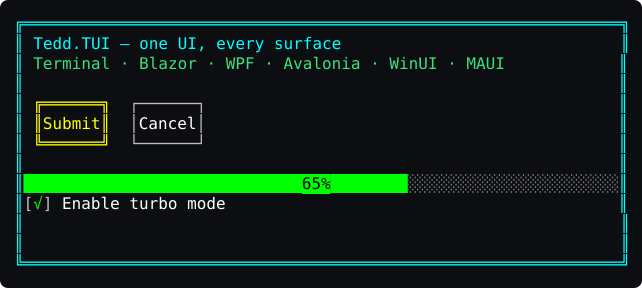

# Tedd.TUI Documentation

Tedd.TUI is a cross-platform TUI framework for .NET with a WPF-inspired control model.
You define a UI once — in XAML or in code — and host it on any supported surface. Every
host renders the exact same character-cell grid, so the application looks identical in a
terminal, a browser, and a desktop window.



## Start here

- **[Getting started](getting-started.md)** — install, hello world for every host (console,
  Blazor, Blazor Canvas, WPF, Avalonia, WinUI, MAUI), in both XAML and code.
- **[XAML guide](xaml.md)** — the markup dialect, controller binding, designer compatibility.

## Platform hosts

| Host | Package | Guide |
|---|---|---|
| Terminal (auto-detect) | `Tedd.TUI.Platform.Console` | [Console](platforms/console.md) |
| Windows Terminal | `Tedd.TUI.Platform.WindowsTerminal` | [Console](platforms/console.md) |
| Linux / macOS terminal | `Tedd.TUI.Platform.LinuxTerminal` | [Console](platforms/console.md) |
| Blazor (Canvas or DOM) | `Tedd.TUI.Platform.Blazor` | [Blazor](platforms/blazor.md) |
| WPF (+ XAML designer preview) | `Tedd.TUI.Platform.Wpf` | [WPF](platforms/wpf.md) |
| Avalonia (Win/macOS/Linux) | `Tedd.TUI.Platform.Avalonia` | [Avalonia](platforms/avalonia.md) |
| WinUI 3 | `Tedd.TUI.Platform.WinUI` | [WinUI](platforms/winui.md) |
| .NET MAUI | `Tedd.TUI.Platform.Maui` | [MAUI](platforms/maui.md) |

Supporting packages: `Tedd.TUI` (core), `Tedd.TUI.Surface.Skia` (shared Skia cell painter
used by the Avalonia/WinUI/MAUI hosts), `Tedd.TUI.Imaging` (bitmap decoding for image-aware
controls).

## How the pieces fit

```
        XAML markup ──┐                       ┌── Terminal (ANSI/VT)
                      │                       ├── Blazor (Canvas / DOM)
   Razor components ──┼──►  Control tree  ──► │── WPF (DrawingContext)
                      │    (UIElement,        ├── Avalonia (Skia)
  Programmatic C# ────┘     layout, events)   ├── WinUI 3 (Skia)
                                │             └── MAUI (Skia)
                                ▼
                          VirtualBuffer
                       (character cell grid)
```

Authoring front ends (XAML, Razor, code) all build the same control tree. The tree lays out
and renders into a `VirtualBuffer` — a grid of character cells plus optional bitmap
placements — and each platform host is a thin display driver that paints that buffer and
feeds input back in cell coordinates.

## Reference

- [Changelog](Changelog.md)
- [Project README](../README.md) — architecture deep-dive, control catalogue, performance notes.
