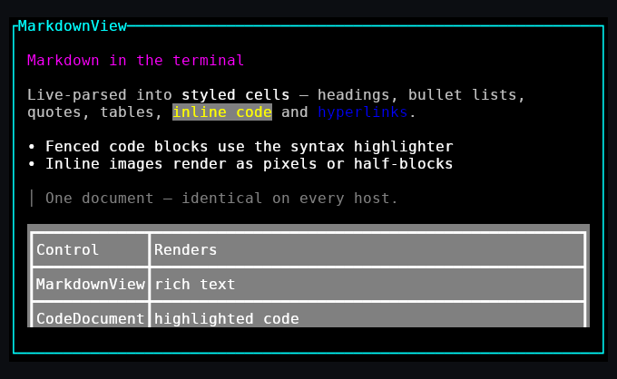
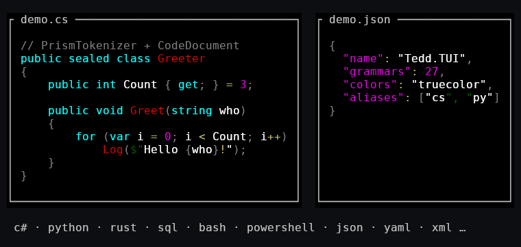
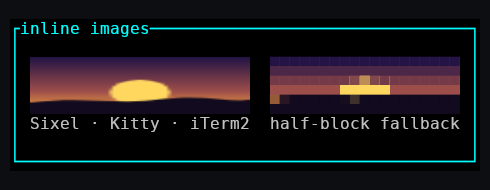

# Tedd.TUI Documentation

Tedd.TUI is a cross-platform TUI framework for .NET with a WPF-inspired control model.
You define a UI once — in XAML or in code — and host it on any supported surface. Every
host renders the exact same character-cell grid, so the application looks identical in a
terminal, a browser, and a desktop window.


## Start here

- **[Getting started](getting-started.md)** — install, hello world for every host (console,
  Blazor, Blazor Canvas, WPF, Avalonia, WinUI, MAUI, standalone Skia, SDL2), in both XAML
  and code.
- **[XAML guide](xaml.md)** — the markup dialect, controller binding, designer compatibility.

## Rich content in the console

The core package renders rich content straight into the character grid — in a plain
terminal just as on every GUI host:

- **Markdown** — `MarkdownView` live-parses markdown into styled cells: headings, bold
  text, bullet lists, quotes, tables, inline code and hyperlinks, all themable via
  `MarkdownTheme`. Fenced code blocks are syntax-highlighted automatically and image
  references render inline.

  

- **Code highlighting** — `CodeDocument` tokenizes source with a PrismJS-style grammar
  engine (ported from [Prism.js](https://github.com/PrismJS/prism), MIT) and renders
  colored cells, standalone or inside markdown fences. 76 grammars ship in the box:
  Ada, ASM 6502, ASP.NET, Bash, BASIC, Batch, C, C#, C++, CIL, C-like, Clojure, CMake,
  COBOL, cshtml/Razor, CSS, CSV, Dart, Diff, Docker, Elixir, Erlang, F#, Fortran, Git,
  Go, GraphQL, Groovy, Haskell, HCL/Terraform, HTTP, INI, Java, JavaScript, JSON, JSON5,
  Julia, Kotlin, LaTeX, Lisp, Lua, Makefile, Markdown, NASM, nginx, Nim, Objective-C,
  OCaml, Pascal, Perl, PHP, PowerShell, Prolog, protobuf, Python, R, Regex, Ruby, Rust,
  Scala, Scheme, Smalltalk, Solidity, SQL, Swift, Tcl, TOML, TypeScript, URI, Verilog,
  VHDL, Visual Basic, WASM, XML/HTML, YAML and Zig.

  

- **Images** — the `Image` control puts real bitmaps into the cell grid: pixel-perfect
  Sixel (Windows Terminal 1.22+, VT340-style terminals), Kitty graphics and iTerm2
  (iTerm2/WezTerm/Ghostty) output in terminals, direct bitmap compositing on GUI and
  browser hosts, and a truecolor half-block fallback everywhere else. Decoding (PNG,
  JPEG, GIF, WebP, …) comes from `Tedd.TUI.Imaging`; see the
  [console guide](platforms/console.md#inline-images).

  

## Controls

Border, Button, Canvas, CheckBox, CodeDocument, ComboBox, ContentControl, DataGrid,
DialogBox, DockPanel, Expander, Grid, GridSplitter, GroupBox, Image, ItemsControl,
ListBox, MarkdownView, MenuBar, MenuItem, PasswordBox, ProgressBar, RadioButton,
ScrollBar, ScrollViewer, Separator, Slider, StackPanel, TabControl, TabItem, Table,
TextBlock, TextBox, TextEditor, Thumb, ToggleButton, ToggleSwitch, TreeView, TreeViewItem,
TuiWindow, UniformGrid, WrapPanel — plus WPF-style data binding, routed events, control templates
and triggers.

## Platform hosts

| Host | Package | Guide |
|---|---|---|
| Terminal (auto-detect) | `Tedd.TUI.Platform.Console` | [Console](platforms/console.md) |
| Windows Terminal | `Tedd.TUI.Platform.WindowsTerminal` | [Console](platforms/console.md) |
| Linux / macOS terminal | `Tedd.TUI.Platform.LinuxTerminal` | [Console](platforms/console.md) |
| Blazor (Canvas or DOM) | `Tedd.TUI.Platform.Blazor` | [Blazor](platforms/blazor.md) |
| WPF (+ XAML designer preview) | `Tedd.TUI.Platform.Wpf` | [WPF](platforms/wpf.md) |
| Avalonia (Win/macOS/Linux) | `Tedd.TUI.Platform.Avalonia` | [Avalonia](platforms/avalonia.md) |
| WinUI 3 | `Tedd.TUI.Platform.WinUI` | [WinUI](platforms/winui.md) |
| .NET MAUI | `Tedd.TUI.Platform.Maui` | [MAUI](platforms/maui.md) |
| Skia standalone (any `SKCanvas`, headless PNG) | `Tedd.TUI.Platform.Skia` | [Skia](platforms/skia.md) |
| SDL2 window (Win/macOS/Linux, game-loop attach) | `Tedd.TUI.Platform.Sdl2` | [SDL2](platforms/sdl2.md) |

Supporting packages: `Tedd.TUI` (core), `Tedd.TUI.Surface.Skia` (shared Skia cell painter
used by the Skia/Avalonia/WinUI/MAUI hosts), `Tedd.TUI.Imaging` (bitmap decoding for image-aware
controls).

### Planned Future Enhancements (Hypotheses)
The framework's current iteration achieves robust WPF structural parity. However, the following concepts remain hypotheses under investigation and are not yet functionally implemented:
- **C# 14 `allows ref struct`:** Upgrading generic constraints to support `ref struct` types in fundamental inheritance hierarchies.
- **Speculative Performance Refactoring:** Additional elimination of `AsSpan()` allocations beyond the verified string search method upgrades.

## How the pieces fit

```
        XAML markup ──┐                       ┌── Terminal (ANSI/VT)
                      │                       ├── Blazor (Canvas / DOM)
   Razor components ──┼──►  Control tree  ──► │── WPF (DrawingContext)
                      │    (UIElement,        ├── Avalonia (Skia)
  Programmatic C# ────┘     layout, events)   ├── WinUI 3 (Skia)
                                │             ├── MAUI (Skia)
                                │             ├── Skia standalone (SKCanvas / PNG)
                                │             └── SDL2 (native window, Skia)
                                ▼
                          VirtualBuffer
                       (character cell grid)
```

Authoring front ends (XAML, Razor, code) all build the same control tree. The tree lays out
and renders into a `VirtualBuffer` — a grid of character cells plus optional bitmap
placements — and each platform host is a thin display driver that paints that buffer and
feeds input back in cell coordinates.

## Reference

- [Changelog](Changelog.md)
- [Project README](../README.md) — architecture deep-dive, control catalogue, performance notes.
