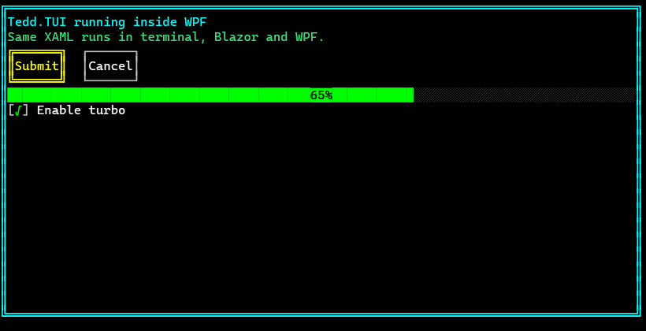

# Getting Started

Tedd.TUI applications are written once and hosted anywhere. This guide shows the same
small UI running on every supported surface — defined in **XAML** or **programmatically**.

All packages target .NET 10 and are published to NuGet as `Tedd.TUI.*`.

## The UI we'll build

XAML (save as `app.xaml`, ship it with your app — e.g. *Copy to Output Directory*):

```xml
<TuiWindow>
  <Border BoxStyle="Double" BorderColor="Cyan">
    <StackPanel Orientation="Vertical">
      <TextBlock Text="Hello Tedd.TUI!" Foreground="Cyan" />
      <TextBox x:Name="NameBox" Width="30" Text="John Doe" />
      <Button Content="Submit" BoxStyle="Double" Click="OnSubmit" />
    </StackPanel>
  </Border>
</TuiWindow>
```

The same UI in code:

```csharp
using Tedd.TUI;

var nameBox = new TextBox { Width = 30, Text = "John Doe" };
var submit = new Button { Content = "Submit", BoxStyle = BoxStyle.Double };
submit.Click += (s, e) => { /* ... */ };

var window = new TuiWindow
{
    Content = new Border
    {
        BoxStyle = BoxStyle.Double,
        BorderColor = TuiColor.Cyan,
        Child = new StackPanel
        {
            Orientation = Orientation.Vertical,
            Children =
            {
                new TextBlock { Text = "Hello Tedd.TUI!", Foreground = TuiColor.Cyan },
                nameBox,
                submit
            }
        }
    }
};
```

Event attributes in XAML (`Click="OnSubmit"`) and `x:Name` fields bind against a
**controller** object you pass to the loader:

```csharp
public class AppController
{
    public TextBox? NameBox;                       // injected via x:Name
    public void OnSubmit() { /* NameBox.Text … */ }
}
```


---

## Console (terminal)

```
dotnet add package Tedd.TUI.Platform.Console
dotnet add package Tedd.TUI.Platform.WindowsTerminal   # truecolor on Windows
dotnet add package Tedd.TUI.Platform.LinuxTerminal     # truecolor on Linux/macOS
```

```csharp
using Tedd.TUI;
using Tedd.TUI.Platform.Console;

var controller = new AppController();
var window = (TuiWindow)XamlLoader.Load(File.ReadAllText("app.xaml"), controller);
// …or build `window` programmatically as above.

var app = new TuiApp(window);   // auto-detects the best terminal backend
app.Run();
```

## Blazor

```
dotnet add package Tedd.TUI.Platform.Blazor
```

**XAML** — one component, pointed at a file under `wwwroot` (or inline via `Xaml="..."`):

```razor
@using Tedd.TUI.Platform.Blazor.Components

<TuiXamlView Source="tui/app.xaml" Controller="@_controller" Width="80" Height="25" />

@code {
    private readonly AppController _controller = new();
}
```

**Razor components** — author the tree in markup Blazor-style:

```razor
<TuiView Width="80" Height="25">
    <TuiStackPanel>
        <TuiLabel Text="Hello Tedd.TUI!" />
        <TuiTextBox Width="30" />
        <TuiButton Text="Submit" OnClick="OnSubmit" />
    </TuiStackPanel>
</TuiView>
```

**Programmatic** — hand a prebuilt `TuiWindow` to the surface:

```razor
<TuiView Width="80" Height="25" Window="@_window" />
```

## Blazor Canvas vs DOM

`TuiView` (and `TuiXamlView`) render through one of two browser surfaces, selected with
the `Mode` parameter:

```razor
<TuiXamlView Source="tui/app.xaml" Mode="TuiRenderMode.Canvas" />  @* default: <canvas> *@
<TuiXamlView Source="tui/app.xaml" Mode="TuiRenderMode.Dom" />     @* styled DOM grid *@
```

- **Canvas** — draws cells onto a `<canvas>`; fastest, pixel-stable.
- **DOM** — emits a grid of styled elements; selectable text, inspectable, and composits
  bitmap graphics via absolutely-positioned `` elements.

## WPF

```
dotnet add package Tedd.TUI.Platform.Wpf
```

```xml
<Window x:Class="MyApp.MainWindow"
        xmlns="http://schemas.microsoft.com/winfx/2006/xaml/presentation"
        xmlns:x="http://schemas.microsoft.com/winfx/2006/xaml"
        xmlns:tui="clr-namespace:Tedd.TUI.Platform.Wpf;assembly=Tedd.TUI.Platform.Wpf"
        Title="Tedd.TUI in WPF" Width="900" Height="500">
    <tui:TuiHostElement x:Name="TuiHost" Source="app.xaml" />
</Window>
```

```csharp
// Code-behind: bind the controller (or set Window to a prebuilt TuiWindow instead).
TuiHost.Controller = new AppController();
// Programmatic alternative:
// TuiHost.Window = BuildWindow();
```

`TuiHostElement` renders the real TUI pipeline inside WPF — including in the Visual Studio
XAML designer, giving you a live preview while you edit. See [WPF](platforms/wpf.md).



## Avalonia

```
dotnet add package Tedd.TUI.Platform.Avalonia
```

```xml
<Window xmlns="https://github.com/avaloniaui"
        xmlns:x="http://schemas.microsoft.com/winfx/2006/xaml"
        xmlns:tui="clr-namespace:Tedd.TUI.Platform.Avalonia;assembly=Tedd.TUI.Platform.Avalonia"
        x:Class="MyApp.MainWindow" Title="Tedd.TUI in Avalonia">
    <tui:TuiHostControl Name="TuiHost" Source="app.xaml" />
</Window>
```

```csharp
TuiHost.Controller = new AppController();
// or: TuiHost.Window = BuildWindow();
```

## WinUI 3

```
dotnet add package Tedd.TUI.Platform.WinUI
```

```xml
<Window x:Class="MyApp.MainWindow"
        xmlns="http://schemas.microsoft.com/winfx/2006/xaml/presentation"
        xmlns:x="http://schemas.microsoft.com/winfx/2006/xaml"
        xmlns:tui="using:Tedd.TUI.Platform.WinUI">
    <tui:TuiHostControl x:Name="TuiHost" Source="app.xaml" />
</Window>
```

```csharp
TuiHost.Controller = new AppController();
// or: TuiHost.Window = BuildWindow();
```

## .NET MAUI

```
dotnet add package Tedd.TUI.Platform.Maui
```

```csharp
// MauiProgram.cs — register the SkiaSharp handlers:
builder.UseMauiApp<App>().UseTeddTui();
```

```xml
<ContentPage xmlns="http://schemas.microsoft.com/dotnet/2021/maui"
             xmlns:x="http://schemas.microsoft.com/winfx/2009/xaml"
             xmlns:tui="clr-namespace:Tedd.TUI.Platform.Maui;assembly=Tedd.TUI.Platform.Maui"
             x:Class="MyApp.MainPage">
    <tui:TuiHostView x:Name="TuiHost" Source="app.xaml" />
</ContentPage>
```

```csharp
TuiHost.Controller = new AppController();
// or: TuiHost.Window = BuildWindow();
```

Touch maps to TUI mouse events. MAUI exposes no cross-platform hardware-keyboard events,
so keyboard input is injected with `TuiHost.SendKey(...)` / `TuiHost.SendText(...)` — see
[MAUI](platforms/maui.md).

## Skia (standalone / headless)

```
dotnet add package Tedd.TUI.Platform.Skia
```

No GUI framework required — render onto any `SKCanvas` you own, or straight to PNG:

```csharp
using Tedd.TUI.Platform.Skia;

using var host = new TuiSkiaHost();
host.SetContent(source: "app.xaml", controller: new AppController());

host.RenderToPng("screenshot.png", columns: 80, rows: 25);   // headless screenshot
// or in your own loop: host.Render(canvas, pixelWidth, pixelHeight);
```

Input is forwarded with `MouseDown/Up/Move` (pixel coordinates), `ProcessKey` and
`SendText`; `RenderRequested` signals when to repaint. See [Skia](platforms/skia.md).

## SDL2

```
dotnet add package Tedd.TUI.Platform.Sdl2
```

A native SDL2 window on Windows/Linux/macOS — no .NET GUI framework:

```csharp
using Tedd.TUI.Platform.Sdl2;

using var host = new TuiSdl2Host();
host.SetContent(source: "app.xaml", controller: new AppController());

host.Run(title: "My App", columns: 80, rows: 25);   // blocks until the window closes
```

Keyboard, text input and mouse arrive through SDL automatically. Already running an SDL
loop? `Attach(window, renderer)` + `HandleEvent`/`RenderFrame` composite the TUI into it —
see [SDL2](platforms/sdl2.md).

---

## Next steps

- [XAML guide](xaml.md) — full dialect reference: controllers, attached properties,
  property-element syntax, colors, designer compatibility.
- [Rich content](README.md#rich-content-in-the-console) — markdown rendering, syntax
  highlighting (27 grammars) and inline images, straight in the console; image protocol
  setup is in the [console guide](platforms/console.md#inline-images).
- Per-platform guides: [Console](platforms/console.md) · [Blazor](platforms/blazor.md) ·
  [WPF](platforms/wpf.md) · [Avalonia](platforms/avalonia.md) · [WinUI](platforms/winui.md) ·
  [MAUI](platforms/maui.md) · [Skia](platforms/skia.md) · [SDL2](platforms/sdl2.md)
