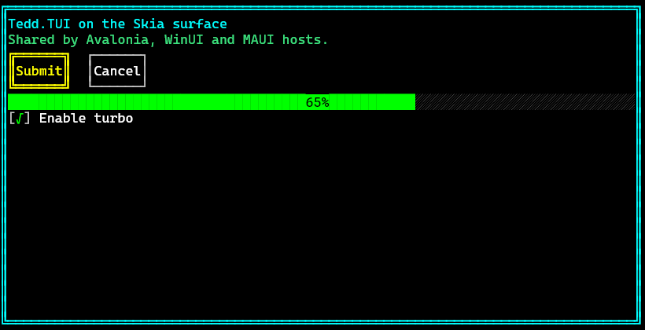

# Skia Host (standalone)

`Tedd.TUI.Platform.Skia` provides `TuiSkiaHost`, a host with **no GUI framework at all**:
it renders a `TuiWindow` straight onto any SkiaSharp `SKCanvas`, or offscreen to an
`SKImage`/PNG. Frames paint through the shared `Tedd.TUI.Surface.Skia` cell painter, so
the output matches every other Tedd.TUI host exactly.

Use it when you own the surface yourself:

- **Headless screenshots** — render XAML to PNG in CI, docs pipelines or tests.
- **Game engines & custom windowing** — OpenTK, Silk.NET, MonoGame (via texture upload),
  video compositors: anywhere you already hold an `SKCanvas` or pixel buffer.
- **Server-side rendering** — no display, no dispatcher, no framework dependencies.



## Usage

```csharp
using Tedd.TUI.Platform.Skia;

using var host = new TuiSkiaHost(fontFamily: "Cascadia Mono", fontSize: 16f);
host.SetContent(source: "app.xaml", controller: new AppController());
// or: host.SetContent(window: myTuiWindow);
// or: host.SetContent(xaml: "<TuiWindow>…</TuiWindow>");

// One-liner headless screenshot: an 80×25 frame as PNG.
host.RenderToPng("screenshot.png", columns: 80, rows: 25);
```

Embedding in your own render loop:

```csharp
host.RenderRequested += ScheduleRedraw;   // may fire on any thread — marshal yourself

void Redraw(SKCanvas canvas, int pixelWidth, int pixelHeight)
{
    host.Render(canvas, pixelWidth, pixelHeight);   // fits as many whole cells as the area holds
}

// Input, in pixel coordinates of the rendered surface:
host.MouseDown(x, y);  host.MouseMove(x, y);  host.MouseUp(x, y);
host.ProcessKey(ConsoleKey.Tab);
host.SendText("hello");
```

## API

| Member | Meaning |
|---|---|
| `SetContent(window, xaml, source, controller)` | Content: existing `TuiWindow` (highest precedence), inline markup, or XAML file path; `controller` is the event/`x:Name` binding target |
| `Render(canvas, pixelWidth, pixelHeight)` | Paint one frame: fills `Background`, fits whole cells, renders the window |
| `RenderToImage(columns, rows)` | Offscreen frame of an exact cell grid as an `SKImage` |
| `RenderToPng(path-or-stream, columns, rows)` | Offscreen frame encoded as PNG |
| `RenderRequested` | The TUI invalidated; schedule a redraw (coalesced, may fire off-thread) |
| `MouseDown/Up/Move(px, py)` | Left-button input in pixel coordinates (moves gated to cell changes) |
| `ProcessKey(key, keyChar, modifiers)` / `SendText(text)` | Keyboard input |
| `Background` | `SKColor` painted behind/around the grid (default black) |
| `FontFamily` / `FontSize` / `SetFont(family, size)` | Monospace font (comma-separated fallbacks allowed) |
| `Window` / `LoadError` | The hosted `TuiWindow`; markup load failure (also drawn into the surface) |
| `Columns` / `Rows` / `CellWidth` / `CellHeight` | Grid and cell metrics of the last rendered frame |
| `CellsForSize` / `SizeForCells` / `ToCell` | Pixel ↔ cell conversions |

## Notes

- Load and render errors are drawn into the canvas instead of throwing, matching the
  other hosts.
- The package references only `Tedd.TUI`, `Tedd.TUI.Surface.Skia` and `SkiaSharp`; on
  Linux servers add the usual `SkiaSharp.NativeAssets.Linux` (or
  `…NoDependencies`) package for the native library.
- For hosting inside Avalonia, WinUI or MAUI, use their dedicated host packages instead —
  they add focus, input mapping and DPI handling for their frameworks on top of the same
  painter.
